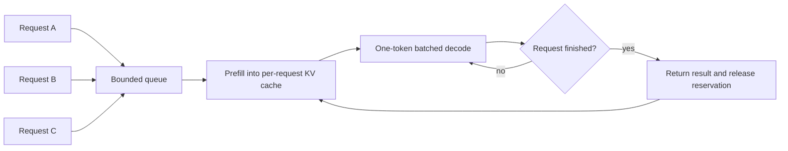
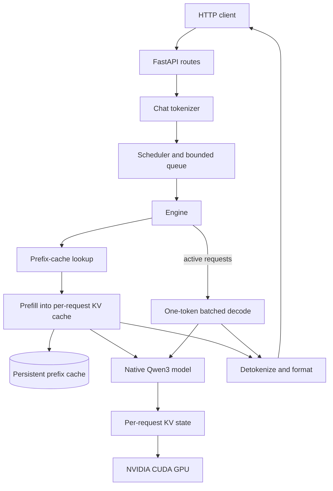

# Helios

Helios is a small, readable inference engine for running
[Qwen3-4B](https://huggingface.co/Qwen/Qwen3-4B) on a local NVIDIA GPU. It
implements the model, weight loading, tokenization, KV caching, generation, and
HTTP serving path directly in PyTorch.

This is an inference-engineering learning project, not a production serving
system. The code favors mechanisms that are easy to inspect, measure, and
change over a broad feature set.

## What is included

- A native PyTorch implementation of Qwen3-4B
- Grouped-query attention, rotary position embeddings, RMS normalization, and
  SwiGLU feed-forward layers
- PyTorch scaled-dot-product attention with Flash Attention selected for
  eligible unmasked CUDA paths
- Hugging Face tokenization and safetensor weight loading
- Single-request prefill and token-by-token decode
- Continuous batching of concurrent requests
- Per-request KV caches and a persistent, block-based prefix cache
- Optional native paged attention with a shared 256-token page pool
- GPU-memory admission checks and a shared active/prefix KV budget
- A non-streaming OpenAI-style chat completions endpoint
- A concurrent HTTP benchmark with per-request and aggregate timing data

## Requirements

- Python 3.11 or newer
- [uv](https://docs.astral.sh/uv/)
- A CUDA-capable NVIDIA GPU with enough memory for Qwen3-4B and its KV cache
- Internet access on first run to download the model snapshot from Hugging Face

The current loader does not support Apple Metal or CPU execution.

## Quick start

```bash
git clone https://github.com/sidmanale643/helios.git
cd helios
uv sync
uv run helios
```

The first start downloads the tokenizer and model weights. If Hugging Face
requires authentication in your environment, set `HF_TOKEN` before starting
Helios.

After warmup completes, the server listens on `http://127.0.0.1:8000`.

```bash
curl http://127.0.0.1:8000/health
```

The health response includes the loaded model revision, compile state, profiled
memory budget, and a scheduler snapshot. Interactive API documentation is
available at [`http://127.0.0.1:8000/docs`](http://127.0.0.1:8000/docs) while
the server is running.

## Chat completions API

Helios implements a focused, non-streaming subset of
`POST /v1/chat/completions`:

```bash
curl http://127.0.0.1:8000/v1/chat/completions \
  --header 'content-type: application/json' \
  --data '{
    "model": "Qwen/Qwen3-4B",
    "messages": [
      {"role": "system", "content": "Answer clearly and briefly."},
      {"role": "user", "content": "Why does a KV cache speed up decoding?"}
    ],
    "temperature": 0.2,
    "top_p": 0.95,
    "max_tokens": 128,
    "stream": false
  }'
```

The response follows the OpenAI chat-completion shape and contains one
assistant choice plus prompt, completion, and total token counts. The
Helios-specific `timings` object reports tokenization, queueing, prefix lookup,
restore, prefill, decode, and cache-store time, together with TTFT, throughput,
and prefix-cache hit rate.

Supported request fields:

| Field | Notes |
| --- | --- |
| `model` | Must match the loaded model; the only implemented architecture is Qwen3-4B. |
| `messages` | 1–128 `developer`, `system`, `user`, `assistant`, or plain `tool` transcript messages. |
| `max_tokens` | 1–2,048; defaults to 256. `max_completion_tokens` is accepted as an alias. |
| `temperature` | 0–2; defaults to 0.2. |
| `top_p` | Greater than 0 and at most 1; defaults to 0.95. |
| `stream` | Must be `false`. |

Streaming, OpenAI tool-call objects, structured outputs, authentication, and
the rest of the OpenAI API are not implemented.

### Continuous batching

Clients send ordinary chat-completion requests concurrently. The scheduler
holds the first request for a short admission window, then prefills each
admitted request into its own exact-capacity KV cache. Active requests share
each one-token decode step, but finish independently; completed requests release
only their own cache reservation while survivors keep decoding unchanged.

Admission is strict FIFO. The queue head joins whenever an active-request slot
and the shared KV-memory budget, including temporary batched-attention storage,
permit it. A larger waiting request never drains or rebuilds existing requests;
it waits until enough memory is released.



Continuous requests restore and retain prompt blocks through the persistent
prefix cache. Prefill is deliberately per request; batching is applied to the
repeated decode step where it matters most.

### Paged attention

Enable the optional native PyTorch paged-attention path with:

```bash
HELIOS_PAGED_ATTENTION=1 HELIOS_TORCH_COMPILE=0 uv run helios
```

This requires PyTorch 2.13 and an Ampere or newer NVIDIA GPU (SM80+) with
FP16 or BF16 weights. A fixed KV pool holds 256-token pages. Each request owns
a page table; prefill and decode read those pages directly through PyTorch's
`varlen_attn`, without rebuilding a padded batch of K/V tensors. There is no
additional kernel dependency.

Completed prefix pages share the same storage. Pages return to the pool when
their last request or prefix-cache reference is released. In this mode prefix
blocks are also 256 tokens, so shorter prefixes are not cached. Admission still
reserves the request's maximum length, rounded up to whole pages, to guarantee
space for decode. Evicting prefix entries frees pages within the pool rather
than returning its backing memory to CUDA.

Paging is off by default, and whole-model `torch.compile` is currently unavailable
in this mode. CUDA numerical tests are included but require a compatible GPU;
CPU checks exercise a reference attention implementation, not the CUDA kernel.

## Architecture



At startup, Helios resolves one Hugging Face snapshot for both tokenizer and
model, checks available GPU memory, loads the safetensors into the native Qwen3
implementation, and creates a provisional KV limit. A cold/prefix warmup covers
the main execution paths and optional compiled graphs. Helios then measures the
warmed cold path and sets one shared memory budget for active request KV and
retained prefix KV.

For a single request, the tokenizer applies the Qwen3 chat template. Helios
hashes complete prompt blocks, restores the longest cached chain of per-layer
K/V snapshots, prefills only unmatched tokens, and decodes one token at a time.
Completed prompt blocks can then be retained for later requests. Cache entries
have a sliding TTL and are evicted least-recently-used when active KV needs
space.

Continuous requests use independent KV caches with their own logical lengths.
New prompts join active decoding when a request slot and memory are available;
finished requests release their allocations without disturbing survivors. Every
request must fit the model context window and the shared KV budget.

Cold prefills use causal scaled-dot-product attention without materializing a
dense mask. On supported NVIDIA GPUs, eligible unmasked attention calls are
forced through PyTorch's Flash Attention backend; masked paths continue through
PyTorch's normal backend selection.

## Diagnostics and logs

`GET /internal/cache` returns the process-local prefix-cache block count, token
count, memory use, capacity, hashes, and hit counts. It is an unprotected
diagnostic endpoint, so do not expose it on an untrusted network.

The server logs request IDs and execution events without logging prompt or
generated text. Useful events include FIFO admissions, active decode membership,
memory or slot admission blocks, prefix-cache hits and stores, completion,
rejection, and failure.

## Configuration

Helios loads a local `.env` file automatically.

| Variable | Default | Purpose |
| --- | --- | --- |
| `HELIOS_MODEL_ID` | `Qwen/Qwen3-4B` | Model repository. No other architecture is currently implemented. |
| `HELIOS_MODEL_REVISION` | latest resolved snapshot | Pins tokenizer and model files to a Hugging Face revision. |
| `HF_TOKEN` / `HF_API_KEY` | unset | Hugging Face authentication. |
| `HELIOS_TORCH_COMPILE` | `0` | Set to `1`, `true`, or `yes` to compile the model with dynamic shapes. |
| `HELIOS_PAGED_ATTENTION` | `0` | Use native paged attention and shared 256-token KV/prefix pages; requires `HELIOS_TORCH_COMPILE=0`. |
| `HELIOS_MAX_GPU_UTILIZATION` | `0.90` | Fraction of total GPU memory available to model residency, activation reserve, and KV state. |
| `HELIOS_WEIGHT_HEADROOM_RATIO` | `0.20` | Additional free-memory requirement before loading weights. |
| `HELIOS_KV_CACHE_HEADROOM_RATIO` | `0.20` | Safety margin above measured warmup activation memory. |
| `HELIOS_PREFIX_CACHE_TTL_SECONDS` | `300` | Sliding lifetime of a cached prompt block. |
| `HELIOS_MAX_BATCH_SIZE` | `8` | Maximum number of concurrently active continuous requests. |
| `HELIOS_MAX_QUEUE_SIZE` | `32` | Maximum number of waiting jobs; excess work receives HTTP 503. |
| `HELIOS_BATCH_WAIT_MS` | `2` | Initial admission window after the first queued request arrives. |

Set `HELIOS_MAX_BATCH_SIZE=1` to serialize ordinary requests while retaining the
queue. More active slots can improve aggregate throughput, but KV memory and
decode cost also grow; benchmark on the target GPU and workload.

## Benchmarks

Start Helios in one terminal, then run the concurrent HTTP benchmark from a
second terminal:

```bash
# Terminal 1
HELIOS_TORCH_COMPILE=1 uv run helios

# Terminal 2
uv run python benchmarks/run.py --label continuous-batch
uv run python benchmarks/run.py --label continuous-batch --concurrency 16
```

The runner validates `dataset.json`, checks server health, sends one isolated
post-health warmup, and then submits dataset requests concurrently. The server's
scheduler—not the benchmark client—forms continuous decode batches. Responses
are printed as they finish. Results are written to `benchmarks/results/` with
raw per-request timings and aggregate elapsed time and output throughput.

Use `--dataset /path/to/dataset.json` for another versioned request set and
`--base-url` or `HELIOS_BASE_URL` for a remote server. See
[`benchmarks/README.md`](benchmarks/README.md) for the dataset schema and protocol.

## Project structure

```text
src/helios/
├── api/                 # FastAPI routes, request schemas, and dependencies
├── runtime/
│   ├── qwen3/           # Model, layers, weights, decoding, and KV state
│   ├── engine.py        # Continuous admission and iteration loop
│   ├── frontend.py      # Chat tokenization and response conversion
│   ├── generate.py      # Single-request warmup and prefix-cache generation
│   ├── prefix_cache.py  # Hashed prompt blocks and K/V snapshots
│   └── scheduler.py     # Bounded FIFO queue and worker lifecycle
├── config.py            # Environment-backed runtime configuration
└── main.py              # Uvicorn entry point
benchmarks/              # Concurrent HTTP benchmark runner
dataset.json             # Default benchmark workload
```

## Current scope

Helios deliberately keeps serving small and inspectable. It does not provide
streaming, quantization, multi-model serving, distributed execution, optimized
custom kernels, or production controls such as authentication and rate
limiting. Continuous batching still prefills one request at a time. The default
decode path uses independent dense per-request caches; native paged attention is
opt-in and does not add chunked prefill or batched prefill.

The goal is to keep a correct, understandable baseline for each mechanism and
measure the effect before adding the next optimization.

## Acknowledgements

- [Qwen3-4B](https://huggingface.co/Qwen/Qwen3-4B) for the model weights and tokenizer
- [LLMs from Scratch: Qwen3](https://github.com/rasbt/LLMs-from-scratch/tree/main/ch05/11_qwen3) for a readable architecture reference
- [PyTorch](https://pytorch.org/) and [FastAPI](https://fastapi.tiangolo.com/)

## License

Helios is released under the [Apache License 2.0](LICENSE).
